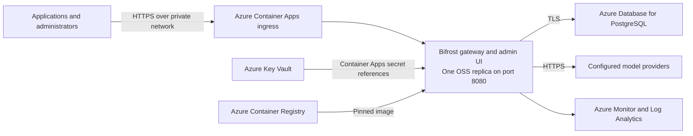

# Bifrost Azure container hosting plan

Status: Ready for Validation. Bicep implementation complete; local checks passed. Azure provisioning is not requested.
Date: 2026-09-09

## Scope
Host the upstream Bifrost gateway on Azure Container Apps. The user requested Bicep implementation and then a Deploy to Azure button and upstream updates in shadowarmor/bifrost. The workspace is now a sparse checkout of that fork, with origin pointing to shadowarmor/bifrost and upstream to maximhq/bifrost.

## Requirements and assumptions
- Azure is the confirmed hosting platform.
- Start with Bifrost OSS, one always-running instance, and database-backed administration through the bundled UI.
- Assume an internal team gateway, accessible through a private network. Public client access is a design input to confirm before provisioning.
- Small initial workload; suggested compute sizes below are starting estimates, not measured capacity guarantees.
- Subscription, region, budget, request volume, maximum request duration, recovery objectives, and Enterprise licensing are not yet selected.
- Recipe: standalone Bicep at resource-group scope, as requested. Environment-backed .bicepparam input supplies secure values.
- The user requested Bicep authoring after the plan. Subscription quota checks and provisioning remain outside the current task.

## Recommended architecture

| Component | Proposed configuration | Reason |
|---|---|---|
| Container Apps environment | VNet integrated, internal environment for the baseline | Private access and managed container operations |
| Bifrost Container App | Linux amd64 image; 1 vCPU, 2 GiB RAM initially; min/max replicas 1; single active revision | Simple OSS deployment with no cold starts |
| PostgreSQL Flexible Server | PostgreSQL 16 or newer, UTF8 database, private connectivity, TLS | Durable config and request logs without container-local SQLite |
| Azure Container Registry | Basic initially; managed identity for image pulls | Store approved, pinned deployment images |
| Key Vault | Provider credentials, DB password, encryption key, setup token | Central secret lifecycle and access control |
| Managed identity | Least-privilege image pull and secret read access | Avoid registry credentials and application-level Key Vault integration |
| Azure Monitor / Log Analytics | Container logs, resource metrics, health and error alerts | Operational visibility |
| Optional telemetry collector | Add if distributed traces or Prometheus scraping are required | Export Bifrost telemetry to the selected backend |

Bifrost is a gateway: the image includes its HTTP API and admin UI. No separate frontend container or GPU is needed when it calls hosted model providers. Redis and a vector database are optional semantic-cache components, not prerequisites for this baseline.

## Container and configuration design
1. Select a released Bifrost version; verify its release notes and record its image digest. Do not deploy the repository's development branch or a floating latest tag.
2. Mirror the approved image into ACR between the foundation and gateway deployments. Project the non-secret config.json through an ACA secret volume; a small startup wrapper copies it to /app/data and execs the upstream entrypoint under its supplied user. No derived image is required. A bootstrap hash in the revision template restarts the app when configuration changes.
3. Set APP_HOST=0.0.0.0, APP_PORT=8080, APP_DIR=/app/data, LOG_LEVEL=info, and LOG_STYLE=json. The upstream image runs as UID 1000; preserve suitable directory permissions.
4. Explicitly configure both config_store and logs_store to use PostgreSQL. Keep /app/data available for startup files; do not rely on its ephemeral filesystem for durable state.
5. Reference secrets using env.VARIABLE_NAME in Bifrost configuration. Inject those variables through Container Apps Key Vault secret references and managed identity.
6. Keep BIFROST_ENCRYPTION_KEY stable across revisions and recoverable with database backups. Configure BIFROST_SETUP_TOKEN before the first-admin bootstrap unless the selected release/configuration provisions admin credentials directly.
7. Use the database/UI as the operational configuration authority initially. Treat config.json as bootstrap configuration, document its hash-based reconciliation rules, and avoid changing file-backed entities unintentionally during upgrades.

## Storage and recovery
- Use PostgreSQL 16+ with UTF8 encoding. Give the Bifrost application role the schema permissions required for startup migrations; use a dedicated database or schema.
- Configure certificate-validated TLS where supported by the selected image and Azure CA trust chain.
- Budget both connection pools. Initially cap the config pool at 10 and the log pool at 20 connections, then tune using observed demand and the database connection limit. These are proposed values.
- Use a small burstable DB tier for a pilot; assess General Purpose and zone-redundant HA for production against availability and regional support.
- Set a deliberate request-log retention period, initially seven days if business requirements permit. Restrict payload logging when prompts or responses contain sensitive data.
- Enable managed backups and test restoration to a separate server. Record the matching Bifrost version and retain the encryption key outside the database backup.
- Choose final RPO/RTO before production. Database HA alone does not make a one-replica gateway highly available.

## Networking and access
- For VNet-wide private access, use an internal Container Apps environment and publish the app at that environment's internal load balancer. In ACA terminology this uses app ingress external=true; the environment still has no public endpoint. App ingress internal is only for clients inside the same Container Apps environment.
- Configure private DNS and a network route for users and applications, including VPN/ExpressRoute if needed. A private admin endpoint must be reachable by the operating team.
- Connect PostgreSQL through its private networking configuration and associated private DNS. Use separate subnets/delegations appropriate to each Azure service.
- Permit outbound DNS and HTTPS to configured model providers, plus required registry, secrets and monitoring connectivity. Select private provider endpoints where applicable and available.
- Terminate TLS at ingress with target port 8080. Keep metrics and management access within the trusted network.
- Enable Bifrost admin authentication and require scoped virtual keys for inference. Configure model allowlists, rate limits and budgets, and verify all unauthenticated inference requests are rejected.
- If public API access is needed, add an explicitly designed public frontend with route restrictions for inference and a private management path. Do not publish the entire shared Bifrost listener without reviewing management access.
- Check streaming through the actual Azure endpoint. Standard ACA HTTP ingress documents a 240-second request timeout. Test long first-token delays, long-lived SSE, and WebSocket APIs if used. Premium ingress has separate idle-timeout options; do not assume those eliminate all request-duration limits. Choose AKS with a suitable ingress design if required durations cannot be supported.

## Availability and scale
- Database-backed OSS: minReplicas=1 and maxReplicas=1. PostgreSQL persists configuration but does not synchronize OSS processes' live in-memory state.
- Use controlled replacement for upgrades, with a maintenance window when necessary. Single-revision mode can temporarily overlap old/new containers; freeze configuration changes during transition and validate schema compatibility. Do not promise zero downtime or use traffic splitting between independently mutable OSS instances.
- File-only OSS can support identical immutable replicas, but UI configuration edits are unavailable and shared governance behavior requires separate validation. It is a separate operating model, not an automatic scale-out switch.
- If coordinated multi-replica HA is required, prefer Bifrost Enterprise on AKS using the official Helm chart with external PostgreSQL. Enterprise mesh needs peer discovery, TCP/UDP 10101 and TCP 10102; confirm the supported clustering mode before attempting it on ACA.

## Implementation phases
1. Finalize inputs: subscription, region, private/public access, providers, version, traffic profile, maximum stream duration, budget and recovery objectives. Check regional service availability and subscription quota before provisioning.
2. Prepare infrastructure: Bicep modules for ACR, network/private DNS, Container Apps, PostgreSQL, Key Vault, identity and monitoring; parameterize development and production separately.
3. Prepare runtime: pinned image, non-secret config.json, environment references, authentication, DB pools, log retention and provider routing. Validate configuration against the selected Bifrost version.
4. Validate and deploy staging: build/scan the image, validate Bicep and deployment what-if, verify networking and permissions, then run the Azure validation/deployment workflow when implementation is requested.
5. Acceptance tests: complete the checks below, record evidence, resolve failures and confirm the hosting choice.
6. Production rollout: use separate production secrets/database, take a backup, deploy during a controlled window, smoke-test and monitor. Keep rollback instructions with migration compatibility constraints.

## Acceptance criteria
- Startup and readiness probe GET /health on port 8080 return 200 after migrations complete; allow sufficient startup time for migrations. Use a conservative liveness policy so a brief database outage does not cause a restart storm.
- Non-streaming and streaming inference work through the final HTTPS endpoint; chunks arrive incrementally and maximum-duration scenarios pass.
- Missing, invalid and out-of-scope credentials are rejected; admin routes require authentication; rate and budget restrictions work.
- Provider timeout/failure invokes the configured fallback where appropriate.
- Container replacement preserves provider configuration, virtual keys and expected logs.
- A database backup can be restored and read using the retained encryption key and compatible image.
- CPU, RAM, latency, errors, provider throttling, DB connections and storage growth are observable, with actionable alerts.
- Upgrade and rollback rehearsal accounts for startup migrations. An older image must not be assumed compatible with an upgraded database.

## Implemented artifacts
- infra/main.bicep: resource-group-scoped entry point, staged foundation/gateway creation, configurable sizing and secure inputs.
- infra/main.bicepparam: environment-backed parameters without stored credentials.
- infra/modules/: platform, private network/DNS, PostgreSQL, secrets, Container Apps environment and gateway.
- deploy/config.json and deploy/start.sh: PostgreSQL-backed bootstrap configuration and entrypoint wrapper.
- infra/README.md: deployment/import commands, provider configuration, verification, recovery and rotation instructions.
- .gitignore and .gitattributes: ignore local parameter/build artifacts and preserve LF shell scripts.

The AVM pattern catalog was checked. Its generic AZD Container Apps patterns do not cover this Bifrost-specific staged bootstrap and private PostgreSQL topology. The implementation uses pinned AVM resource modules for identity (0.6.0), registry (0.13.0) and Log Analytics (0.16.1). Local resource modules expose the application-specific network, database, Key Vault and gateway configuration directly.

The initial DB connection uses the administrator of a dedicated Bifrost server, since ARM cannot create PostgreSQL SQL roles. The runbook calls this out and describes replacing it with a database/schema owner login before broader production use. ACR and Key Vault have authenticated public service endpoints; Bifrost and PostgreSQL use private ingress. VPN/peering and custom/public frontend routing are not created.

## Resource inventory and validation status
Proposed per environment: one resource group, one Container Apps environment, one Bifrost Container App, one PostgreSQL server and database, one Key Vault, one user-assigned identity, one Log Analytics workspace, and the required VNet/subnets/private DNS. ACR can be shared across environments. Telemetry collectors and public ingress components are optional additions.

No Azure account inspection, quota validation, image import, runtime test or deployment has been performed. Cost estimation follows region, SKU, uptime, retention and availability decisions; include Container Apps, PostgreSQL, registry, monitoring, network egress and model-provider usage.

## Validation proof
Validation workflow: azure-prepare followed by azure-validate for local authoring checks. Full Azure validation is pending; status is not Validated or Deployed.

| Check | Command or method | Result |
|---|---|---|
| Bicep compilation | az bicep build --file infra/main.bicep --outdir infra/out | Passed with Bicep 0.47.16, no diagnostics |
| Bicep lint | az bicep lint --file infra/main.bicep | Passed with no diagnostics |
| Configuration schema | uv run --with jsonschema, Draft7Validator against upstream transports/config.schema.json | Passed, zero errors; current upstream schema, not a selected release runtime test |
| Parameter compilation | az bicep build-params with synthetic environment values | Passed; deployGateway=true compiled correctly; no real credentials used |
| Static identity/RBAC review | Gateway identity, ACR and Key Vault role assignments | AcrPull scoped to registry; Key Vault Secrets User scoped to dedicated vault; no subscription-wide application roles |
| Image startup | docker info --format {{.OSType}} | Not run: Docker Desktop Linux engine is unavailable |
| Azure validation / what-if / policy / quota | Requires selected target subscription, resource group, region and deployment inputs | Deferred; no cloud changes requested |

Validation date: 2026-09-09. The only output-secret lint suppression emits provider environment and secret names, never credential values.

## Pending decisions
Azure subscription and region, network exposure, traffic and request duration, availability target, OSS versus Enterprise, and budget.

## Fork publication and portal deployment
- README button targets the public, compiled infra/azuredeploy.json on shadowarmor/bifrost:dev.
- infra/portal.bicep deploys the private pilot in one portal operation using the official image directly; it omits ACR. The main CLI template retains the ACR import path by default.
- infra/image-lock.json pins Bifrost v2.1.1 by Docker manifest digest, verified against Docker Hub with linux/amd64 support on 2026-09-09.
- scripts/azure/build-template.ps1 generates the ARM template. The Azure workflow uses Bicep 0.47.16 and fails when source and generated artifact differ.
- The daily upstream workflow proposes updates directly from maximhq:dev through one PR into the fork's dev, without executing upstream source, force-pushing, or automatically merging.
- Checks: generated template matches source; Bicep lint passes; workflow YAML parses; config matches the fork schema; GitHub-hosted Azure compilation and lint pass.
- No core, provider or UI code changed; provider-harness and UI build checks do not apply to these infrastructure/workflow changes.

## Sources
- [Bifrost upstream repository](https://github.com/maximhq/bifrost)
- [Bifrost deployment requirements](https://docs.getbifrost.ai/deployment-guides/runtime-contract)
- [Bifrost setup and configuration modes](https://docs.getbifrost.ai/quickstart/gateway/setting-up)
- [Bifrost storage](https://docs.getbifrost.ai/deployment-guides/helm/storage)
- [Bifrost governance](https://docs.getbifrost.ai/deployment-guides/config-json/governance)
- [Bifrost Enterprise clustering](https://docs.getbifrost.ai/enterprise/clustering)
- [Azure Container Apps ingress](https://learn.microsoft.com/en-us/azure/container-apps/ingress-overview)
- [Azure Container Apps secrets](https://learn.microsoft.com/en-us/azure/container-apps/manage-secrets)
- [Azure Container Apps revisions](https://learn.microsoft.com/en-us/azure/container-apps/revisions)
- [Azure PostgreSQL private networking](https://learn.microsoft.com/en-us/azure/postgresql/network/concepts-networking-private)
