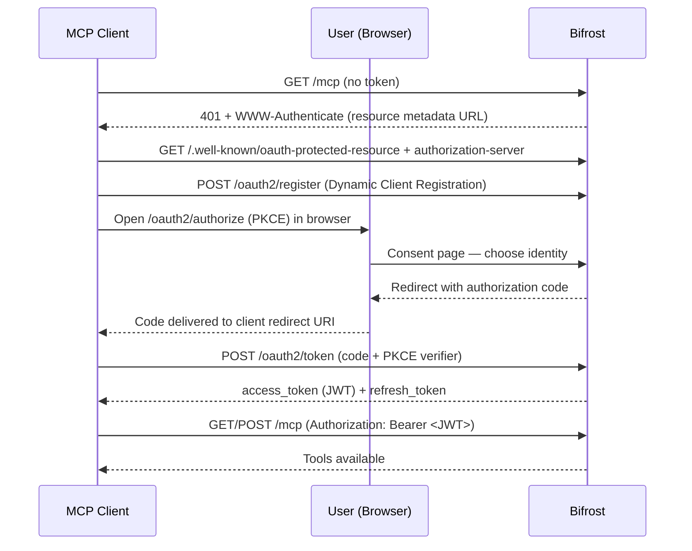

## Overview

When Bifrost acts as an [MCP Gateway](./gateway), external MCP clients connect to its `/mcp` endpoint. This page covers how those **inbound clients authenticate to Bifrost**.

There are two ways a client can present itself:

- **Header credentials** — a virtual key, API key, or session token sent as a request header. Simple to script, ideal for backend and machine-to-machine use.
- **OAuth 2.1** — Bifrost acts as an OAuth authorization server, and the client connects through a browser consent flow, receiving a short-lived JWT. Ideal for interactive clients like Claude Desktop, Claude Code, or Cursor, where pasting a raw key into client config is awkward.

<Note>
This page is about authenticating clients **to** Bifrost. For how Bifrost authenticates **to upstream MCP servers** it connects to, see the outbound [Authentication](./auth/overview) guides instead — that's the opposite direction.
</Note>

---

## Authentication Modes

A single setting, `mcp_server_auth_mode`, controls which credential types `/mcp` accepts:

| Mode | Header credentials (VK / api-key / session) | Bifrost-issued JWT | Discovery endpoints |
|---|---|---|---|
| `headers` (default) | Accepted | — | Disabled |
| `both` | Accepted | Accepted | Enabled |
| `oauth` | Rejected | Accepted | Enabled |

- **`headers`** — `/mcp` accepts header credentials only. The OAuth surface is not served: the `.well-known` discovery endpoints and the issuance endpoints (`/oauth2/register`, `/oauth2/authorize`, `/oauth2/token`) all return `404`.
- **`both`** — `/mcp` accepts header credentials **and** Bifrost-issued JWTs. Discovery is served so OAuth clients can connect.
- **`oauth`** — `/mcp` accepts Bifrost-issued JWTs only; header credentials are rejected.

A request must carry **exactly one** credential type. If an OAuth access token and a header credential (`x-bf-vk`, `X-Api-Key`, or a Bearer VK) arrive on the same request, Bifrost rejects it with a `conflicting credentials` error — even in `both` mode. `both` means either credential is accepted, not both at once.

<Warning>
In `oauth` mode, clients that authenticate with a virtual key or API key header can no longer reach `/mcp`. Use `both` if you need header and OAuth clients to coexist.
</Warning>

<Warning>
`oauth` mode also blocks [Token Exchange (`token_exchange`)](./auth/token-exchange) MCP clients: that auth type needs the caller's own identity-provider token to reach `/mcp`, but `oauth` mode accepts Bifrost-issued JWTs only and rejects everything else, including the caller's IdP token. Use `headers` or `both` for any deployment using `token_exchange`.
</Warning>

---

## How the OAuth Connect Flow Works

When `mcp_server_auth_mode` is `both` or `oauth`, Bifrost is a full OAuth 2.1 authorization server for the `/mcp` resource. A client that doesn't yet have a token discovers the server, registers itself, and walks the user through a browser consent step.



The flow follows current OAuth standards so off-the-shelf MCP clients work without custom code:

- **Protected resource metadata** (RFC 9728) — the `401` response points clients at the discovery documents.
- **Dynamic Client Registration** (RFC 7591) — clients self-register; no manual client setup.
- **PKCE** (S256) — public clients authenticate without a shared secret.
- **Resource indicators** (RFC 8707) — tokens are bound to the `/mcp` resource via the `aud` claim.

---

## Identity Modes at Consent

During the consent step, Bifrost shows the user how they can identify themselves. The page header names the connecting client — for example **"Claude Code wants to connect"** — and offers the modes available for your deployment:


| Mode | Binds the grant to | Availability |
|---|---|---|
| **Virtual key** | A virtual key you paste on the consent page | Always available |
| **Session** | A server-minted, anonymous session identity | Only when `enforce_auth_on_inference` is `false` **and** the person consenting is signed in to Bifrost (dashboard session or SSO user) |
| **User** | Your signed-in dashboard user | Requires SSO / SCIM |

- **Virtual key** carries the same governance (budgets, rate limits, tool scoping) the key already has — the JWT simply represents that key.
- **Session** is an anonymous identity for development and open deployments. Because the grant itself carries no identity, Bifrost only lets a signed-in person hand it out: the consent page offers session mode when the browser has a valid dashboard session (or an SSO user), and `PUT /api/oauth2/consent/flows/{id}` answers `401` to a session-mode submit that arrives with only the consent link's token. Running with dashboard auth disabled does not count as being signed in. Session mode is unavailable altogether once `enforce_auth_on_inference` is on.
- **User** binds the grant to the authenticated person, so per-user upstream tool authorizations unify under one identity.

<Info>
**User mode requires SSO/SCIM** (enterprise). When no identity provider is configured, the consent page offers virtual key mode, plus session mode when the consenting person is signed in to the dashboard.
</Info>

---

## Configuration

<Tabs group="config-method">
<Tab title="Web UI">

1. Open **Config** and go to the **MCP** settings.
2. Set **MCP Server Auth Mode** to `headers`, `both`, or `oauth`.
3. When using `both` or `oauth`, set the **OAuth Server** settings: an **Issuer URL** (required, since otherwise the issuer would be derived from the unauthenticated request `Host` header), and the **Authorization Code** and **Access Token** lifetimes.
4. Click **Save**.


</Tab>
<Tab title="API">

```bash
curl -X PUT http://localhost:8080/api/config \
  -H "Content-Type: application/json" \
  -d '{
    "client_config": {
      "mcp_server_auth_mode": "both",
      "oauth2_server_config": {
        "issuer_url": "https://bifrost.example.com",
        "auth_code_ttl": 300,
        "access_token_ttl": 600
      }
    }
  }'
```

</Tab>
<Tab title="config.json">

```json
{
  "client": {
    "mcp_server_auth_mode": "oauth",
    "oauth2_server_config": {
      "issuer_url": "https://bifrost.example.com",
      "auth_code_ttl": 300,
      "access_token_ttl": 600,
      "disable_vk_identity": false
    }
  }
}
```

| Field | Type | Required | Description |
|-------|------|----------|-------------|
| `mcp_server_auth_mode` | string | No | `headers` (default), `both`, or `oauth`. |
| `oauth2_server_config.issuer_url` | string | Yes, when mode is `both` or `oauth` | Stable public URL advertised as the issuer in discovery docs and the JWT `iss` claim. Supports `env.MY_VAR` syntax. |
| `oauth2_server_config.allowed_redirect_uris` | string[] | No | Exact approved remote callback URIs. Remote callbacks are denied unless listed. Loopback callbacks and `cursor://anysphere.cursor-mcp` remain available without entries. API changes require dashboard authentication. |
| `oauth2_server_config.auth_code_ttl` | integer | No | Authorization code lifetime in seconds (default `300`, max `900` = 15 minutes). |
| `oauth2_server_config.access_token_ttl` | integer | No | Issued JWT lifetime in seconds (default `600`). |
| `oauth2_server_config.disable_vk_identity` | boolean | No | Require identity-provider login: removes the virtual-key option from consent and cuts off existing vk-mode grants (see [Token Lifetime & Revocation](#token-lifetime--revocation)). Only honored when an identity provider is configured, and only valid when `mcp_server_auth_mode` is `oauth` (400 otherwise). |

</Tab>
</Tabs>

<Note>
`oauth2_server_config` only applies when `mcp_server_auth_mode` is `both` or `oauth`. The RSA signing key used for JWTs is generated automatically the first time it's needed — no setup required. It is persisted to the database, so it survives restarts and is shared across all replicas; previously issued tokens stay valid after a restart.
</Note>

<Warning>
`issuer_url` is required whenever `mcp_server_auth_mode` is `both` or `oauth`, for single-host deployments too: saving a config that turns on discovery without one is rejected. Left to a per-request fallback, the issuer identity would be derived from the unauthenticated request `Host` header on the always-public `/.well-known/` endpoints, so the `issuer`, `token_endpoint`, and `jwks_uri` that MCP clients trust would depend on whatever `Host` value a request carried.
</Warning>

---

## Connecting a Client

With `both` or `oauth` enabled, point the MCP client at Bifrost's `/mcp` URL — for example `https://bifrost.example.com/mcp`. No key needs to be pasted into the client config.

1. The client hits `/mcp`, gets a `401`, and discovers the authorization server.
2. It registers itself and opens a browser to the consent page.
3. The user chooses an identity (virtual key, session, or user).
4. The client receives a token and connects; aggregated tools become available.

When the access token expires, the client uses its refresh token to obtain a new one silently — the browser step happens only once.

---

## Managing Grants

Each completed OAuth connection is a **grant** — a refresh-token lineage Bifrost issued to a client. The **OAuth Grants** page lists them: the client, the bound identity, when the grant was created, and when it was last used, with a **Revoke** action.


Revoking a grant stops its refresh token from rotating immediately, so the client can no longer renew access.

The page is backed by `GET /api/oauth2/sessions` (list active grants, filtered and paginated) and `DELETE /api/oauth2/sessions/{id}` (revoke a grant), so the same operations are scriptable.

<Note>
A revoked grant's current access token is a short-lived JWT that keeps working on `/mcp` until it expires (up to `access_token_ttl`, default `600` seconds). After that the client is fully cut off and must reconnect through the consent flow.

This is deliberate: a holder of the virtual key or user credentials can always start a new authorized session, so invalidating the access token mid-flight adds little security while costing a per-request lookup. Lower `access_token_ttl` for a tighter window.
</Note>

<Info>
The **OAuth Grants** page lists credentials Bifrost **issued to clients** for inbound `/mcp` access. This is distinct from [MCP Sessions](./sessions), which tracks per-user credentials Bifrost holds for **upstream** MCP servers.
</Info>

---

## Token Lifetime & Revocation

- **Access tokens** are JWTs valid for `access_token_ttl` (default 600s). On every `/mcp` request Bifrost validates the JWT (signature, expiry, issuer, and audience) and confirms the bound identity still exists: a user-mode token is rejected with `401` when the user is gone, and a vk-mode token resolves to its key, which governance refuses with `403` when it is inactive or expired, the same way the inference endpoints refuse it. The identity check reads an in-memory cache, so in the common case it adds no database round-trip (vk-mode falls back to a single store lookup only on a cache miss).
- **Refresh tokens** rotate on each use and have no fixed expiry. A token is invalidated by rotation, by the bound virtual key or user becoming inactive or deleted, or by an explicit revoke.
- **Rotating a virtual key** (`POST /api/governance/virtual-keys/{id}/rotate`, bulk rotation, or a scheduled rotation) revokes every vk-mode grant that key minted: their refresh tokens return `invalid_grant` on the next refresh, and authorization codes consented to with the key but not yet exchanged can no longer be exchanged. The revocation and the new key value are saved together, so a rotation that fails changes neither. Clients connected through the key must complete the OAuth flow again with the new value. The rotation cooldown keeps the old key value working for direct use; it does not keep grants alive.
- An explicit revoke marks the grant's refresh-token row revoked, so renewals stop immediately — but it does **not** remove the bound identity, so the identity check still passes and the already-issued access token keeps working until it expires. Lower `access_token_ttl` to shorten that window.
- **Deleting** the bound virtual key or user is stronger than revoking a grant: it revokes the grant immediately *and* the identity check rejects the grant's already-issued access token on its next `/mcp` request, instead of letting it live out its TTL.
- Enabling `disable_vk_identity` (require identity-provider login) cuts off all **virtual-key**–mode grants immediately — they are rejected at `/mcp` and denied on refresh — so those clients must re-authenticate as a user. Only applies in `oauth` mode with an identity provider configured.
- Enabling `enforce_auth_on_inference` blocks session-mode (anonymous) tokens at `/mcp`, but does **not** delete or invalidate their grants — the grants remain in the database and become valid again if enforcement is later disabled. To remove a session-mode grant permanently, revoke it on the **OAuth Grants** page.

---

## Discovery Endpoints

When discovery is enabled (`both` or `oauth`), Bifrost serves the standard documents MCP clients fetch automatically:

| Endpoint | Purpose |
|---|---|
| `GET /.well-known/oauth-protected-resource` | Protected resource metadata (RFC 9728) |
| `GET /.well-known/oauth-authorization-server` | Authorization server metadata (RFC 8414) |
| `GET /.well-known/jwks.json` | Public signing keys for JWT verification (RFC 7517) |

In `headers` mode these endpoints return `404`, as do the issuance endpoints `/oauth2/register`, `/oauth2/authorize` and `/oauth2/token`. Discovery responses are sent with `Cache-Control: no-store` so a shared cache or CDN in front of Bifrost never serves a stored copy.

Client registration bounds its free-text fields: `client_name` up to 2048 bytes, `scope` up to 4096 bytes, and at most 32 `redirect_uris` of up to 2048 bytes each. The authorize request bounds `state` to 8192 bytes. Anything larger is refused with `400` before any state is stored.

---

## Troubleshooting

### Discovery returns 404
**Symptom:** A client can't discover the authorization server; `.well-known` endpoints return `404`.
**Cause:** `mcp_server_auth_mode` is `headers`, so the OAuth surface is disabled.
**Fix:** Set the mode to `both` or `oauth`.

### Header credential rejected on /mcp
**Symptom:** A virtual key or API key that worked before now gets a `401`.
**Cause:** `mcp_server_auth_mode` is `oauth`, which accepts JWTs only.
**Fix:** Use `both` to accept header credentials alongside OAuth.

### Key refused with 403 on /mcp
**Symptom:** A request with a valid virtual key gets `403` with `virtual key is inactive` or `virtual key has expired`.
**Cause:** The key authenticated, but governance refuses it, exactly as it would on an inference request.
**Fix:** Reactivate the key or extend its expiry; the change applies on the next `/mcp` request.

### Conflicting credentials on /mcp
**Symptom:** `conflicting credentials: an OAuth token and a virtual key header were both provided`.
**Cause:** The client completed an OAuth flow but is also configured with a VK header, so both arrive on one request. Claude Code does this in `both` mode when the VK is set under `x-bf-vk` / `X-Api-Key` instead of `Authorization`.
**Fix:** Send only one credential — remove the VK header, or configure it as `Authorization: Bearer <vk>` so the client uses header auth and skips OAuth.

### Consent page redirects to sign-in
**Symptom:** Opening the consent link sends you to Bifrost's sign-in page instead of showing the identity options.
**Cause:** Authorizing without a Bifrost account is turned off. [`mcp_enable_temp_token_auth`](./auth/overview#the-mcp_enable_temp_token_auth-toggle) is off by default, so a signed-in account is the only way through.
**Fix:** Sign in — you'll be brought back to the consent page to choose an identity. To let people authorize without a Bifrost account, turn the toggle on.

### Session option missing, or session consent returns 401
**Symptom:** The consent page offers only **Virtual key**, or submitting **Session** returns `401` with `session mode requires an authenticated consenting user`.
**Cause:** Session mode grants an anonymous identity, so only a signed-in person can hand it out. The consent link's own token is not a sign-in, and neither is running with dashboard auth disabled.
**Fix:** Sign in to the Bifrost dashboard in the same browser and reopen the consent link, or authorize with a virtual key instead.

### Consent page says the link is no longer valid
**Symptom:** The consent page shows *"This link is no longer valid"*.
**Cause:** Consent links are one-time and short-lived. This one has expired, was already used, or was altered.
**Fix:** Restart the connection from your MCP client to get a fresh link.

### Client keeps re-opening the browser
**Symptom:** The consent flow runs on every connection.
**Cause:** The client isn't persisting its tokens, or its refresh token was revoked.
**Fix:** Confirm the client stores its credentials; check the **OAuth Grants** page to see whether the grant was revoked.

### Token rejected after issuer change
**Symptom:** Previously issued tokens fail validation after changing `issuer_url`.
**Cause:** The `iss` claim in existing tokens no longer matches the configured issuer.
**Fix:** Clients reconnect to obtain tokens with the new issuer.

### Save rejected with "issuer_url must be set"
**Symptom:** Switching `mcp_server_auth_mode` to `both` or `oauth` is rejected with a 400 mentioning `issuer_url`.
**Cause:** `issuer_url` is required whenever discovery is enabled; see the warning above.
**Fix:** Set `oauth2_server_config.issuer_url` to Bifrost's stable public URL in the same request.

---

## Next Steps

- **[Bifrost as an MCP Gateway](./gateway)** — Expose aggregated tools to external MCP clients.
- **[MCP Sessions](./sessions)** — Inspect and manage per-user credentials for upstream servers.
- **[Virtual Keys](../features/governance/virtual-keys)** — Govern budgets, rate limits, and tool scope for the identities behind grants.

### Callback destinations

Remote OAuth clients must have their exact callback URI configured in `client.oauth2_server_config.allowed_redirect_uris` before registration or authorization. For example, add `"https://app.example.com/oauth/callback"`; wildcards are not supported. Existing registrations and pending flows are checked against the current list. URI credentials, fragments, missing hosts, and unsafe schemes are rejected. The consent page shows the client name and exact callback destination before you grant access. Only approve applications and destinations you recognize.
